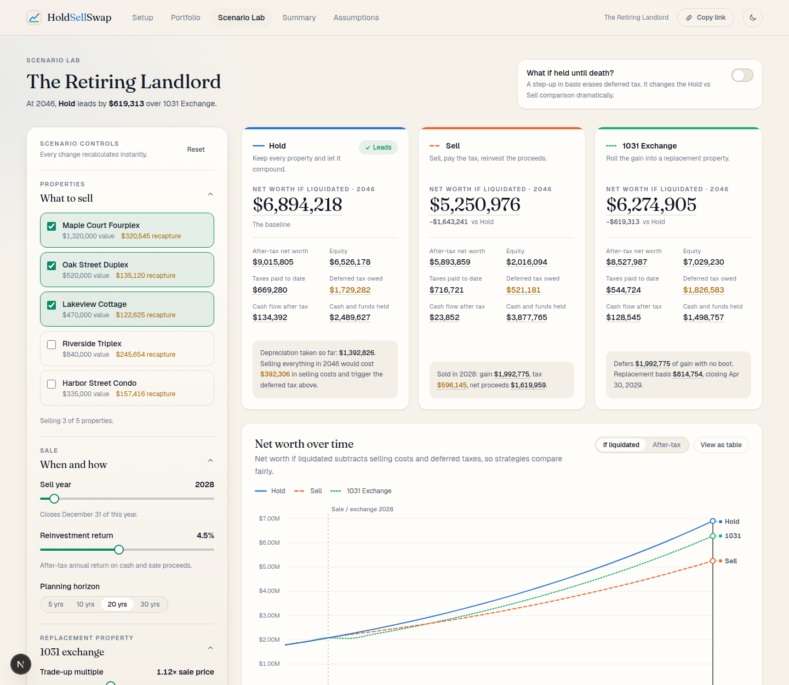
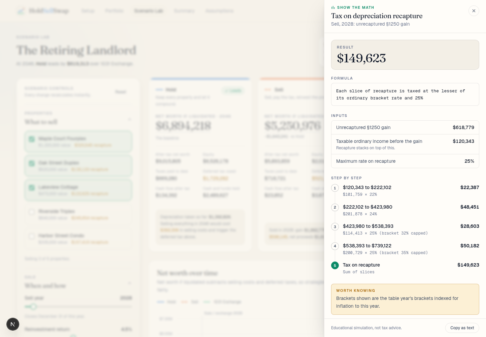
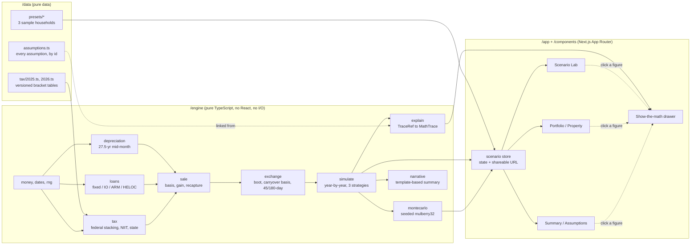

# HoldSellSwap

**Hold, sell, or swap? See the tax math before you decide.**

HoldSellSwap is a deterministic real estate portfolio simulator. Load a household (or build one), and it shows what happens to the portfolio over 5 to 30 years under three strategies: **Hold**, **Sell**, and **1031 Exchange**. Every number on screen opens a "Show the math" panel with the formula, the inputs and the step-by-step arithmetic.

> **Educational simulation. Not tax, legal or investment advice.** It models simplified U.S. federal and flat-rate state tax rules and leaves out several rules that can matter a great deal (see [What is not modeled](#what-is-not-modeled)). Consult a qualified professional before acting.



<table>
  <tr>
    <td></td>
    <td></td>
  </tr>
</table>

## The 60-second pitch

Financial advisors keep getting the same question from landlords: _"Should I keep this property, sell it, or do a 1031 exchange?"_ The honest answer depends on depreciation recapture, bracket stacking, the 3.8% NIIT, loan terms, the reinvestment rate and, above all, what happens at death. Most calculators hide that behind a single number.

HoldSellSwap puts the whole decision on one screen:

- **Scenario Lab**: drag the sell year or the reinvestment rate and three strategy lanes recalculate instantly. A draggable time scrubber updates every card; optional Monte Carlo bands show the 10th/50th/90th percentile outcomes.
- **"Where did the money go?"**: an animated waterfall from sale price to net proceeds with depreciation recapture treated as a first-class tax, not a footnote.
- **1031 clock**: the 45-day identification and 180-day closing windows are drawn on a timeline. Miss one and the engine fails the exchange and taxes the sale.
- **Step-up at death**: one toggle shows how a basis step-up flips the Hold vs Sell comparison.
- **Traceability**: click any figure (a net worth, a tax, a basis) and a drawer shows the formula, the inputs, and every step, with links to the assumption behind it.

The engine is pure TypeScript with integer-cent arithmetic. The same inputs always give the same outputs, to the cent.

## Quick start

```bash
npm install
npm run dev          # http://localhost:3000
```

Deep links to the sample households: `/lab?preset=retiring-landlord`, `/lab?preset=accidental-portfolio`, `/lab?preset=leveraged-builder`. Append `&theme=dark` to force dark mode. Every view is shareable: the URL carries the full scenario (`?s=…`).

| Command             | What it does                                          |
| ------------------- | ----------------------------------------------------- |
| `npm run dev`       | Start the dev server                                  |
| `npm run build`     | Production build (deploys to Vercel with zero config) |
| `npm test`          | Run the engine, data and share-link tests (Vitest)    |
| `npm run lint`      | ESLint (including rules that keep the engine pure)    |
| `npm run typecheck` | `tsc --noEmit` in strict mode                         |
| `npm run format`    | Prettier                                              |

## How it is built



```
engine/            pure logic + tests (engine/__tests__)
  money.ts           integer-cent helpers, exact integer powers
  depreciation.ts    27.5-year straight line, mid-month convention, in half-months
  loans.ts           fixed, interest-only, ARM (caps), HELOC (draws): monthly, rolled up yearly
  tax.ts             brackets, §1(h) stacking, 25% recapture cap, NIIT, state, incremental tax
  sale.ts            adjusted basis, amount realized, gain classification, §1231 netting
  exchange.ts        boot rules, replacement basis (two derivations), carryover depreciation, windows
  simulate.ts        the annual simulation for Hold / Sell / Exchange
  montecarlo.ts      seeded percentile bands
  explain.ts         "Show the math": serializable TraceRefs resolved into step-by-step traces
  narrative.ts       deterministic plain-English summary
data/              tax tables (versioned by year), presets, assumptions registry
components/        UI (charts are custom SVG with d3-scale / d3-shape)
app/               pages: / · /portfolio · /lab · /property/[id] · /summary · /assumptions · /build
lib/               scenario store, share-link encoding, formatting
```

**Design decisions worth knowing**

- **Money is integer cents.** Rates are applied and rounded immediately, so rounding never accumulates. Compounding uses an exact integer power (`powInt`) instead of `Math.pow`, whose last bit can differ across JavaScript engines.
- **Taxes are incremental.** A strategy is charged the household's tax _with_ the portfolio minus its tax on other income alone, so wages never leak into the comparison. Layers (operations, recapture, capital gains, NIIT, state) telescope exactly to the total.
- **One cash account.** All cash flow, taxes and sale proceeds run through a single account earning the after-tax reinvestment rate, which keeps the books closed and auditable (a test asserts the reconciliation every year).
- **Two headline metrics.** _After-tax net worth_ (cash plus equity) and _Net worth if liquidated_ (minus selling costs and deferred taxes) so Hold, which has not yet paid its tax, compares fairly with Sell, which has.
- **Traceability is data, not decoration.** A figure is a serializable `TraceRef`; `resolveTrace` rebuilds the explanation from the engine's own result objects, so the steps always reproduce the number to the cent.

## Testing

`npm test` runs 155 tests:

- **Unit tests** for money, depreciation (including the 3.485% January first year), loans (IO to amortizing, ARM caps, HELOC draws, four paid-off liens), tax (brackets, 25% recapture cap, 0/15/20 stacking, NIIT), sale classification and the exchange boot rules.
- **Edge cases, explicitly**: IO to amortizing transition, ARM reset hitting a cap, HELOC draws, a property with four paid-off liens, a sale at a loss, negative cash-flow years, a zero-gain sale, and a sale in the same year as an improvement.
- **Golden-file tests** lock the complete simulation output (year rows, sale, exchange, taxes, events, loan schedules) for each preset household in `engine/__tests__/golden/`. Any change in the math appears as a reviewable diff.
- **Property-based invariants** ([fast-check](https://fast-check.dev)) generate random households, loans and strategies and assert the accounting identities: net proceeds = price − costs − loan payoff − taxes; the cash account reconciles every year; realized gain = recognized + deferred in an exchange; the two replacement-basis derivations agree; loan balances never go negative; depreciation rolls up exactly; results are deterministic. This suite found a real bug during development (a denormal interest rate produced `NaN`). Stress it with `FC_RUNS=600 FC_SEED=987654 npm test`.
- **Independent cross-checks**: depreciation, a loan balance and a full year of tax were recomputed in a separate implementation and agree to the cent with the golden files.
- **Purity tests** scan the engine's source for `Math.random`, `Date.now`, DOM access and UI imports.

## Tax assumptions and simplifications

Every assumption lives in [`data/assumptions.ts`](data/assumptions.ts), is rendered on the `/assumptions` page, and is linked from the "Show the math" drawer. Summary:

**Depreciation and basis**

- Residential rental buildings: straight line over 27.5 years, **mid-month convention** (counted in half-months, so it is exact). Land is never depreciated.
- Depreciable basis = (purchase price + capitalized closing costs) × (1 − land share). Capital improvements are depreciated as **separate 27.5-year tranches** from the month placed in service.
- Adjusted basis = purchase price + capitalized closing costs + improvements − accumulated depreciation.

**Sale**

- Amount realized = price − selling costs. Total gain = amount realized − adjusted basis.
- **Unrecaptured §1250 gain** (depreciation recapture) = min(gain, depreciation taken), taxed at ordinary rates **capped at 25%**. The rest is long-term capital gain at 0/15/20% by taxable-income position, stacked on ordinary income and recapture (IRC §1(h)).
- 3.8% **NIIT** on the lesser of net investment income and MAGI above the statutory threshold (not inflation-indexed). Flat **state** rate on net rental income and gains.
- A net loss on sale is an ordinary **§1231 loss**. Same-year sales are netted before classification.
- Federal brackets, the standard deduction and capital-gain breakpoints live in versioned files (`data/tax/2025.ts`, `2026.ts`), indexed forward at the inflation assumption.

**1031 exchange**

- Entire gain deferred when proceeds roll into a replacement of equal or greater value **and** debt. **Boot** (cash received, or net debt relief not offset by new debt or cash paid in) is taxable: recognized gain = min(realized gain, boot), classified as recapture first (the conservative ordering).
- Replacement basis = carryover basis + new money; derived two ways and checked for equality. Depreciation continues on the **remaining** recovery period for the carryover basis (Treas. Reg. §1.168(i)-6) and depreciation history carries over for recapture.
- The **45-day / 180-day windows** run from the December 31 closing. Missing either fails the exchange and the sale is fully taxable.
- **Step-up in basis at death** is a toggle: it zeroes deferred tax (selling costs still apply).

**Time and cash**

- Opening balance sheet is Dec 31 of the as-of year; projections are calendar years. Sales close December 31. Taxes are paid in the year incurred.
- The cash account and reinvested proceeds earn an **after-tax** return. A negative balance (out-of-pocket funding) is charged the same rate as an opportunity cost.
- Property tax does not reassess; year-one rent equals in-place rent; the ARM index follows a linear path.

### What is NOT modeled

- **Passive activity loss limits (§469).** Rental losses are assumed to offset other income in full. In reality, above roughly $150,000 of income the losses are usually suspended. This can overstate the benefit of negative-cash-flow years.
- **AMT.**
- **Section 121** (primary-residence exclusion), for example a former home converted to a rental.
- **Installment sales** (§453) and seller financing.
- **Cost segregation, bonus depreciation, §179, QBI (§199A).**
- 1031 identification rules (three-property / 200%), reverse and improvement exchanges, DSTs, opportunity zones.
- Estate and gift taxes; state-specific rules; itemized deductions; Medicare IRMAA effects; property-tax reassessment; prepayment penalties.

## Where the engine might be wrong (for review)

This list is for a reviewer. The items I would check first:

1. **2026 tax figures** were entered from memory of IRS Rev. Proc. 2025-32 and **must be verified** (`data/tax/2026.ts` says so). The 2025 table is more reliable.
2. **Standard-deduction shortfall ordering.** When the deduction exceeds ordinary income, I shelter unrecaptured §1250 gain before long-term gain (my reading of §1(h)(1)(E)(ii)). This only matters at low incomes.
3. **Boot character and timing.** Recognized boot is taxed as recapture first, in the year the replacement closes. A real return may use the installment method or different ordering.
4. **Carryover depreciation mechanics.** The carryover tranche restarts at the replacement's first full month with the old tranche's remaining half-months, and excess basis starts a fresh 27.5-year schedule. Edge cases (partial-year splits, mid-year acquisitions) are simplified.
5. **Deferred tax liability** is the tax if everything sold in one December, stacked on that year's income. For large portfolios this overstates a real, staged exit; it is deliberately conservative and consistent across strategies.
6. **Passive loss limits** (above) make some Accidental Portfolio years show tax _benefits_ from rental losses that a real investor at that income might not get. I set that household's other income low enough to stay near the phase-out, but the limitation stands.
7. **Section 1231 netting** of a loss against gains reduces the long-term bucket first rather than following the full Schedule D worksheet.
8. **NIIT** treats all rental income as net investment income and all other income as non-investment income.
9. **Dec 31 sale and mid-month convention.** Hypothetical "if sold today" tax uses the December mid-month depreciation convention while balance-sheet rows show Dec 31 basis; the half-month difference is explained in the basis roll-forward.
10. **Monte Carlo** randomizes only appreciation and rent growth, not interest rates, vacancy or tax law, and uses `Math.log/cos/sqrt` (not guaranteed bit-identical across engines, unlike the rest of the engine).

## What I would build next

- A suitability layer: IRR / equity multiple per strategy, risk-adjusted metrics, and a one-page client PDF generated server-side.
- **Passive activity loss** carryforwards and the $25,000 special allowance; **installment sale** and **DST** strategies; **cost segregation** with §1245 recapture.
- State tax engines with real brackets and conformity to §1031.
- Intra-year timing (month-level sales and cash flows) and a true QI cash ledger.
- Calibrated Monte Carlo (stochastic rates and vacancy, fat tails), run in a Web Worker.
- Scenario comparison and saved households per advisor, with an audit export of every trace to CSV or JSON.
- Accessibility audit with screen-reader testing of the chart scrubber and a high-contrast / print theme.
- Visual regression tests (Playwright) and a CI pipeline running lint, types, tests and a Lighthouse budget.

## License and disclaimer

For demonstration and education. Not tax, legal or investment advice. Tax law changes; verify every figure against current IRS publications.
